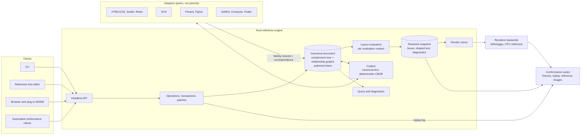

# NUIF — Neutral User Interface Format

**Authored intent, resolved state, stable identity and explicit loss accounting in one portable document model for user interfaces.**

[](https://github.com/refpath/nuif/actions/workflows/ci.yml)
[](#license)
[](Cargo.toml)
[](apps/editor/README.md)
[](spec/README.md)
[](research/README.md)

Citation metadata is provided in [`CITATION.cff`](CITATION.cff). The current
software citation identifies the latest published editor prerelease. It does
not cite the draft specification as an accredited standard.

[Problem](#problem) ·
[Scope](#scope) ·
[Architecture](#architecture) ·
[Repository](#repository) ·
[Method](#method) ·
[Status](#status) ·
[Contributing](#contributing) ·
[License](#license)

---

## Problem

Interface designs move between design editors, design systems, source frameworks and automation tools by regeneration. Each export flattens authored constraints, components, token bindings and provenance into pixels, a vendor scene graph or generated code; each import guesses them back. Three consequences follow: round trips lose information, the loss is silent, and entity identity does not survive the trip, so later edits cannot be synchronized as patches.

NUIF treats portability as a synchronization problem. One canonical document keeps the authored intent and the resolved evaluation state side by side under stable identifiers, records every lossy mapping as a typed fidelity class, preserves data it does not understand, and exposes every mutation as a replayable semantic operation. Editors, runtimes and adapters become peers of the document rather than owners of it.

## Scope

| NUIF is | NUIF is not |
|---------|-------------|
| A draft specification for a vendor-neutral authored-interface document model: identity, containment, relationship graphs, layout intent, resolved geometry, paint, text, components, tokens, behavior, provenance, extensions | A Figma clone or a Figma file format; vendor formats are adapters |
| A Rust reference engine (model, protocol, layout, render scene, codecs, query, headless API and CLI) that falsifies the specification | A renderer specification; GPU command streams are implementation detail behind a scene boundary |
| A reference test editor that replicates a conventional design-editor layout and authors NUIF state directly | A product editor; its feature set is fixed to what conformance testing, import and export require |
| An executable conformance kit: fixtures, operation replay, layout matrices, reference rasterization, fidelity diagnostics | A claim that pixels uniquely recover an original program, resource or behavior |
| A proposed model-neutral observation/reconstruction contract using typed operations, validation and explicit inference provenance | A required AI model, provider, training framework or promise of screenshot-lossless import |
| A machine-readable research corpus with claims, questions and experiments | A standard; that status requires conformance profiles, neutral governance and independent implementations |

## Architecture



Principles that the diagram encodes:

- the canonical document is the only owner of authored state; every client, including the editor, mutates it through semantic operations;
- resolved state is derived per evaluation context and never overwrites authored intent;
- identity is semantic and independent of path, order and geometry;
- adapters emit fidelity records (`lossless`, `representable`, `approximated`, `preserved_unrenderable`, `unsupported`) and correspondence records; silent loss is a conformance failure;
- unknown extensions survive transit byte-for-byte;
- collaboration is a profile above canonical documents, not part of them;
- the headless API and CLI are the primary test surface; GUI automation is supplementary.

## Repository

| Path | Content |
|------|---------|
| `docs/whitepaper/` | Research synthesis, architecture thesis, risk register, cross-industry patterns |
| `research/` | Evidence records, claims, open questions, experiment registry, coverage contract, schema |
| `spec/` | Draft normative modules (model, identity, components, layout, paint/resources/text, operations, extensions, serialization/package, provenance, collaboration, security, automation, semantics, observation/reconstruction) |
| `rfcs/` · `adrs/` | Proposals for the specification · decisions for the reference implementation |
| `crates/` | Rust workspace: model, protocol, layout, pinned text shaping, render, codecs, query, API, CLI, WebAssembly binding and shared seeded testing |
| `apps/editor/` | Reference test editor: architecture, source installation, headless contract, UI specification |
| `conformance/` | Suite plan, test-harness architecture, fixtures including the v0 falsification experiment |
| `adapters/` · `schemas/` | Adapter contracts and interchange schemas |
| `tools/` | Research graph ingestion, validators, commit lint |

## Method

Research is structured data. Each record in `research/items/` has a stable identifier, a primary source with locators, a confidence value, typed relations to claims and other records, and links to the specification, decisions, code and experiments it informs. `research/coverage.yaml` maps every architectural front to its evidence and status (`covered`, `experiment-required`, `ongoing`), so gaps are detected structurally. Claims become normative only through the RFC process and an executable conformance fixture.

Testing is designed for automated trial loops: generate or load a document, apply operations, export and import through adapters, compare canonical forms, resolved layouts and reference images, minimize failures, and record a machine-readable report. The harness design is in `conformance/HARNESS.md`.

## Status

| Surface | Maturity | Boundary |
|---------|----------|----------|
| Reference editor | Research preview; current release `0.1.0-alpha.3` | Semantic Versioning applies to the editor application only |
| Draft specification | Pre-draft | No normative conformance profile is published |
| Executable adapter and conformance profiles | Experimental | Results apply only to each declared profile and evaluation matrix |
| WebAssembly binding | Experimental `nuif-wasm-api-0` | Byte-oriented text/CBOR, validation, patch and history parity; no host authority or browser-layout claim |
| Direct Rust SDK | Experimental `nuif-api` façade | Package-aware load/validate/apply/export over one core; no stable C ABI or crates.io publication claim |
| Package/resources | Experimental implementation; Gate I incomplete | Deterministic package plus narrow independently parsed RGBA8 PNG and static TrueType resource paths are executable; a three-OS CI matrix is configured, while broad media/font matrices, external reproduction and successful hosted matrix evidence remain open |
| Capture/reconstruction | Experimental contracts and deterministic baselines | Browser/screenshot normalization plus one pinned local live-CDP segment, typed proposals, calibration primitives and a finite loop exist; no portable capture, broad accuracy or model claim |
| Project | Open research project; not a standard | Standards status requires neutral governance and independent implementations |

Gates B through H are complete under the bounded, quantified criteria in `research/AUDIT.md`. The workspace executes structural validation, anchored atomic operations, replay/inversion, canonical text and deterministic CBOR, measured hostile-input limits, responsive profile-0 layout, bounded explicit fixed/`fr` Grid tracks and placement, exact CPU rasterization, pinned NUIF/Taffy/Chrome layout trials, seeded reports and headless and native-shell editor drivers. Gate C covers sparse row/column flow, explicit placement and spans without a schema-loss exemption. Gate D pins shaping, outlines, hard-line layout, encoded-sRGB paint and integer composition; scene and raw-RGBA hashes reproduce on macOS/aarch64, Linux/aarch64 and Linux/x86_64, while PNG encoding is non-normative and paths, images, instances and extension paint remain property-attributed fidelity records. Seven retentive source/package adapter profiles are integrated across HTML/CSS, SVG 2, DTCG 2025.10, Penpot v3 packages, static React JSX and static Svelte, with import, export, synchronization, hostile-input checks and CLI conformance; Svelte additionally passes a pinned official-compiler oracle. An eighth executable profile covers normalized Figma Plugin API snapshot and mutation-plan mapping plus a compiled no-network review shell, without claiming live host execution. A machine-audited inventory separates these executable profiles from four researched or externally bounded targets. Complete fixture authoring, AccessKit-driven deterministic GUI trials, standard-library-only Python v0 reproduction, metadata-free register and existing-tree collaboration checkpoints, a pinned Automerge operation-transport oracle, hostile editor interaction trials, a scaling benchmark suite, native host packaging and cross-checked WebAssembly and MCP developer surfaces are automated. The native shell exposes the complete model-backed profile-zero editing surface while leaving future-profile sections of the draft UI specification explicit; concurrent entity creation and collaboration garbage collection, a foreign tree materializer, a general-purpose second implementation, signed native distribution and external interoperability review remain incomplete.

Gates I through L are not complete. The package segment of Gate I is now
executable: `.nuif` is a deterministic bounded package, stable assets and exact
resources have distinct identities, resolution is explicit, and the CLI/editor
preserve package resources. `cargo xtask gate-i-package` records cross-writer,
fixpoint, identity, resolver and hostile/one-over evidence.
`cargo xtask gate-i-image` independently decodes the narrow
`nuif-png-rgba8-0` subset, preserves exact encoded resources and repeats
resource-aware CPU rendering. `cargo xtask gate-i-font` compares the narrow
`nuif-opentype-static-single-0` subset across two Rust parser families, enforces
exact package metadata and explicit embedding review, and rejects malformed and
one-over resources. Gate I still lacks the broader PNG and OpenType matrices,
external writer and successful hosted cross-platform package/media evidence.
The CI workflow now runs all three narrow resource gates independently on
Linux, Windows and macOS and archives each platform report; that configuration
does not become reproduction evidence until the hosted jobs pass. RFC
0011/specification 14 have executable
provider-neutral observation, browser/screenshot baseline, typed-proposal,
flat-copy rejection, calibration and finite-loop primitives. The local Gate J
segment now drives pinned Chromium, retains exact resources/font/accessibility
evidence, excludes exercised secret canaries and beats a one-view baseline at a
held-out viewport. Gate J still requires portable cross-OS/browser and broader
source evidence; Gate K still requires reconstruction accuracy and an
independent evaluator. No LoRA/QLoRA artifact or distillation is implemented. The editor's
`0.1.0-alpha.3` version is not maturity evidence for these research fronts.
Specifications remain drafts and no standards conformance profile is published.

Run the automated baseline:

```sh
cargo xtask all # installs/reuses the pinned browser and runs every gate
cargo xtask browser-install # optional browser prefetch
cargo xtask gate-wasm # pinned-browser initialization and Node/native byte parity
cargo xtask wasm-package # downloadable direct-browser developer archive
cargo xtask gate-mcp # current stateless stdio protocol and native byte parity
cargo xtask mcp-package # live-tested host developer archive
cargo xtask cli-package # exercised standalone developer-tool archive
cargo xtask trial 24301 100
cargo xtask gate-b # 10,000 patches; raster sample every 100 patches
cargo xtask hostile-inputs # boundary/one-over time and allocator report
cargo xtask reduction-profile # hierarchical/choice reduction and fixture evidence
cargo xtask editor-hostile-inputs # semantic, parser and snapshot rejection report
cargo xtask fuzz-smoke # bounded AddressSanitizer campaigns over five core surfaces
cargo xtask adapter-audit # research/profile/gate coverage for all advertised targets
cargo xtask performance # portable release-mode latency and allocation budgets
cargo xtask codec-benchmark # codec size, latency, allocation and admission evidence
cargo xtask gate-c # NUIF/Taffy/pinned-Chrome layout report
cargo xtask gate-d-text # HarfBuzz golden shaping + separate raster report
cargo xtask editor-trial # author the v0 fixture and emit editor evidence
cargo xtask editor-gui-trial # exercise AccessKit and reproduce shell pixels
cargo xtask editor-package # build, smoke-test and archive the host application
cargo xtask editor-launch # package and open the native application
cargo xtask editor-install --user --channel source # persistent local build
cargo xtask editor-doctor --user # verify receipt, binary and integration
cargo xtask editor-update --user --channel alpha --check # resolve only
cargo xtask editor-update --user --channel alpha # verified explicit update
cargo xtask editor-rollback --user # reactivate the retained previous build
cargo xtask editor-uninstall --user # remove only marked managed paths
cargo xtask gate-f # retentive HTML/CSS subset synchronization
cargo xtask gate-f-v0 # full-v0 model sync plus editor/CLI source bridge
cargo xtask gate-g # independent Python v0 parse/write/layout/render
cargo xtask gate-h # exhaustive collaboration register convergence
cargo xtask gate-i-package # deterministic package/resource evidence
cargo xtask gate-i-image # independent RGBA8 PNG/resource/render evidence
cargo xtask gate-i-font # independent static TrueType/resource/policy evidence
cargo xtask gate-figma # pure Plugin API snapshot/plan mapping (not a live host)
cargo xtask capture-baselines # bounded capture/reconstruction contract evidence
cargo xtask gate-j-live # pinned live Chromium/resource/secret/held-out evidence
cargo run --locked -p nuif-cli -- fixture v0-responsive-card /tmp/v0.nuif
cargo run --locked -p nuif-editor -- --headless \
  --script conformance/fixtures/v0-responsive-card/editor-trial.jsonl \
  --document /tmp/v0.nuif --output /tmp/edited.nuif
cargo run --locked -p nuif-editor # launch the native editor
```

`cargo xtask all` bootstraps the pinned Python research-validator environment, wasm-bindgen toolchain and Chrome for Testing under ignored `target/`, then runs research validation, Rust verification, WebAssembly/native API parity, the short full-raster trial, the 10,000-patch Gate B trial, release-mode hostile-input, codec-decision and performance trials, the Gate C differential layout trial, both Gate D text/render trials, complete headless/native editor trials, bounded retentive adapter bridges, the independent Gate G reproduction, exhaustive Gate H collaboration-register convergence, the Gate I package, narrow-image and narrow-font segments, and the bounded capture/reconstruction contract report. Each measured run leaves a JSON report or snapshot under `target/`; `target/verification-manifest.json` indexes the complete evidence set and records success or the first failed step. CI archives both the individual evidence and this manifest.

## Contributing

Research, specification, conformance, implementation and adapter contributions are accepted; see `CONTRIBUTING.md` for the record schema, the writing register and the single-line commit rule. Governance is described in `GOVERNANCE.md`; security reports in `SECURITY.md`.

## License

Reference code is dual-licensed under Apache-2.0 or MIT (`LICENSE-APACHE`,
`LICENSE-MIT`). The repository has not adopted specification-wide copyright or
patent terms. `docs/whitepaper/08-governance-and-standardization.md` records the
licensing requirements that precede standards-track publication.
