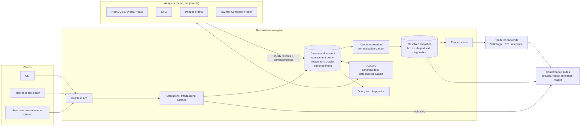

# NUIF — Neutral User Interface Format

**Authored intent, resolved state, stable identity and explicit loss accounting in one portable document model for user interfaces.**

[](https://github.com/refpath/nuif/actions/workflows/ci.yml)
[](#license)
[](Cargo.toml)
[](spec/README.md)
[](research/README.md)

[Problem](#problem) ·
[Scope](#scope) ·
[Architecture](#architecture) ·
[Repository](#repository) ·
[Method](#method) ·
[Status](#status) ·
[Contributing](#contributing) ·
[License](#license)

---

## Problem

Interface designs move between design editors, design systems, source frameworks and automation tools by regeneration. Each export flattens authored constraints, components, token bindings and provenance into pixels, a vendor scene graph or generated code; each import guesses them back. Three consequences follow: round trips lose information, the loss is silent, and entity identity does not survive the trip, so later edits cannot be synchronized as patches.

NUIF treats portability as a synchronization problem. One canonical document keeps the authored intent and the resolved evaluation state side by side under stable identifiers, records every lossy mapping as a typed fidelity class, preserves data it does not understand, and exposes every mutation as a replayable semantic operation. Editors, runtimes and adapters become peers of the document rather than owners of it.

## Scope

| NUIF is | NUIF is not |
|---------|-------------|
| A draft specification for a vendor-neutral authored-interface document model: identity, containment, relationship graphs, layout intent, resolved geometry, paint, text, components, tokens, behavior, provenance, extensions | A Figma clone or a Figma file format; vendor formats are adapters |
| A Rust reference engine (model, protocol, layout, render scene, codecs, query, headless API and CLI) that falsifies the specification | A renderer specification; GPU command streams are implementation detail behind a scene boundary |
| A reference test editor that replicates a conventional design-editor layout and authors NUIF state directly | A product editor; its feature set is fixed to what conformance testing, import and export require |
| An executable conformance kit: fixtures, operation replay, layout matrices, reference rasterization, fidelity diagnostics | A code generator that infers program semantics from pixels |
| A machine-readable research corpus with claims, questions and experiments | A standard; that status requires conformance profiles, neutral governance and independent implementations |

## Architecture



Principles that the diagram encodes:

- the canonical document is the only owner of authored state; every client, including the editor, mutates it through semantic operations;
- resolved state is derived per evaluation context and never overwrites authored intent;
- identity is semantic and independent of path, order and geometry;
- adapters emit fidelity records (`lossless`, `representable`, `approximated`, `preserved_unrenderable`, `unsupported`) and correspondence records; silent loss is a conformance failure;
- unknown extensions survive transit byte-for-byte;
- collaboration is a profile above canonical documents, not part of them;
- the headless API and CLI are the primary test surface; GUI automation is supplementary.

## Repository

| Path | Content |
|------|---------|
| `docs/whitepaper/` | Research synthesis, architecture thesis, risk register, cross-industry patterns |
| `research/` | Evidence records, claims, open questions, experiment registry, coverage contract, schema |
| `spec/` | Draft normative modules (model, identity, components, layout, paint and text, operations, extensions, serialization, provenance, collaboration, security, automation, semantics) |
| `rfcs/` · `adrs/` | Proposals for the specification · decisions for the reference implementation |
| `crates/` | Rust workspace: model, protocol, layout, render, codecs, query, API, CLI and shared seeded testing |
| `apps/editor/` | Reference test editor: architecture, headless contract, UI specification |
| `conformance/` | Suite plan, test-harness architecture, fixtures including the v0 falsification experiment |
| `adapters/` · `bindings/` · `schemas/` | Adapter contracts, WASM bindings, interchange schemas |
| `tools/` | Research graph ingestion, validators, commit lint |

## Method

Research is structured data. Each record in `research/items/` has a stable identifier, a primary source with locators, a confidence value, typed relations to claims and other records, and links to the specification, decisions, code and experiments it informs. `research/coverage.yaml` maps every architectural front to its evidence and status (`covered`, `experiment-required`, `ongoing`), so gaps are detected structurally. Claims become normative only through the RFC process and an executable conformance fixture.

Testing is designed for automated trial loops: generate or load a document, apply operations, export and import through adapters, compare canonical forms, resolved layouts and reference images, minimize failures, and record a machine-readable report. The harness design is in `conformance/HARNESS.md`.

## Status

Gate B (canonical model, operations and encodings) is complete. The workspace now executes structural validation, anchored atomic operations, replay/inversion, canonical text and deterministic CBOR, measured hostile-input limits, responsive profile-0 layout, solid-color CPU rasterization, seeded trial reports and a headless editor driver. Gate C browser/Taffy differential layout, shaped text, HTML/CSS synchronization, the Masonry GUI shell, collaboration profiles and an independent implementation remain incomplete. Specifications are drafts; no conformance profile is published. `research/AUDIT.md` records the accuracy review, evidence limits, quantified gates and stop conditions.

Run the automated baseline:

```sh
cargo xtask all
cargo xtask trial 24301 100
cargo xtask gate-b # 10,000 patches; raster sample every 100 patches
cargo xtask hostile-inputs # boundary/one-over time and allocator report
cargo run --locked -p nuif-cli -- fixture v0-responsive-card /tmp/v0.nuif
cargo run --locked -p nuif-editor -- --headless \
  --script conformance/fixtures/v0-responsive-card/editor-trial.jsonl \
  --document /tmp/v0.nuif --output /tmp/edited.nuif
```

`cargo xtask all` bootstraps the pinned Python research-validator environment under ignored `target/`, then runs research validation, Rust verification, the short full-raster trial, the 10,000-patch Gate B trial, the release-mode hostile-input allocation/time trial and the headless editor replay. The hostile-input run writes `target/hostile-input-report.json`.

## Contributing

Research, specification, conformance, implementation and adapter contributions are accepted; see `CONTRIBUTING.md` for the record schema, the writing register and the single-line commit rule. Governance is described in `GOVERNANCE.md`; security reports in `SECURITY.md`.

## License

Reference code is dual-licensed under Apache-2.0 or MIT (`LICENSE-APACHE`, `LICENSE-MIT`). Specification and research licensing for standards-track publication is defined in `docs/whitepaper/08-governance-and-standardization.md`.
