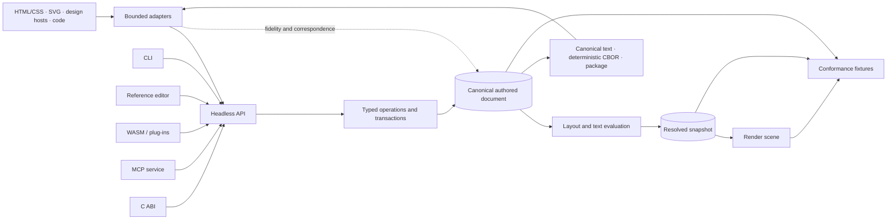

# NUIF — Neutral User Interface Format

**A portable model for authored interfaces: stable identity, editable intent,
resolved output, and explicit accounting for every lossy conversion.**

[](https://github.com/refpath/nuif/actions/workflows/ci.yml)
[](https://refpath.github.io/nuif/)
[](#license)
[](Cargo.toml)
[](apps/editor/README.md)
[](spec/README.md)

NUIF is an open research project for moving interface documents between
editors, source formats, runtimes, and automation tools without pretending that
every system can represent the same ideas. It combines a draft interchange
model with a Rust reference engine, bounded adapters, a reference editor, and
an executable conformance harness.

This repository is not a published standard and the current profiles are not a
promise of universal format coverage. The experiments exist to discover where
the model works, where it loses information, and where it should be changed.

[Try it](#try-it) · [How it works](#how-it-works) ·
[Use the project](#use-the-project) · [Status](#project-status) ·
[Verify it](#verification) · [Documentation](#documentation)

## Why NUIF exists

Most interface transfers are one-way regeneration. A design export becomes a
vendor scene graph, pixels, or generated source; the next importer has to infer
the original components, constraints, tokens, and relationships. Three things
usually disappear along the way:

- authored intent, such as layout rules and component relationships;
- stable identity, which is needed to synchronize later edits; and
- an honest record of what was preserved, approximated, or discarded.

NUIF treats interchange as a synchronization problem. A document retains
authored state and separately records its resolved evaluation state. Entities
keep stable identifiers. Changes are typed semantic operations. Adapters must
emit property-level fidelity and correspondence records instead of silently
flattening unsupported features. Unknown extension data remains opaque and
retentive.

That design makes the same core useful from a native application, a browser
plug-in, a command-line tool, or an agent protocol without making any one host
the owner of the format.

## Try it

The workspace uses the toolchain pinned in `rust-toolchain.toml`. With Git,
Rustup, and the platform build prerequisites installed:

```sh
git clone https://github.com/refpath/nuif.git
cd nuif
cargo xtask verify
```

Create a deterministic example package and inspect it through the CLI:

```sh
cargo run --locked -p nuif-cli -- fixture v0-responsive-card /tmp/card.nuif
cargo run --locked -p nuif-cli -- validate /tmp/card.nuif
cargo run --locked -p nuif-cli -- inspect /tmp/card.nuif
```

Open the reference editor directly from the checkout:

```sh
cargo run --locked -p nuif-editor
```

The editor is a development and conformance tool, not a store-distributed end
user product. For a persistent user-scoped source installation, use:

```sh
cargo xtask editor-install --user --channel source
cargo xtask editor-doctor --user
```

The checkout remains the control plane for explicit updates, rollback, and
uninstallation. It does not require Apple or Microsoft marketplace payment,
administrator access, or weakened operating-system security. Exact release-tag
installation and platform paths are documented in
[`apps/editor/INSTALLING.md`](apps/editor/INSTALLING.md).

## How it works



The boundaries are deliberate:

- The canonical document owns authored state. Clients mutate it through the
  same semantic operation layer.
- Resolved geometry, shaped text, and diagnostics are derived for an explicit
  evaluation context; they do not overwrite intent.
- Adapters are peers around the core. Host-specific assumptions stay outside
  the model and are reported through declared profiles.
- Filesystem, network, authentication, GUI state, and GPU behavior remain in
  the surrounding ports. The core is deterministic for the same document and
  operation sequence.
- Conformance is defined by fixtures and reports, not by the behavior of the
  reference editor alone.

The detailed design is in the
[`architecture whitepaper`](docs/whitepaper/01-architecture.md), the
[`host integration guide`](docs/HOST-INTEGRATION.md), and the
[`SDK and bindings guide`](docs/SDK-AND-BINDINGS.md).

## What NUIF is—and is not

| NUIF is | NUIF is not |
|---|---|
| A pre-standard draft model for editable interface semantics, identity, resources, behavior, provenance, and extensions | A Figma, Canva, Affinity, or Penpot file format |
| A deterministic Rust reference engine and set of executable profiles | A claim that the reference implementation defines the standard by itself |
| A conformance kit for operations, codecs, layout, rendering, packages, adapters, and host surfaces | A claim that pixel similarity proves semantic equivalence |
| A reference editor for authoring fixtures and testing the complete operation path | A general-purpose commercial design editor |
| A provider-neutral observation and reconstruction research contract | A required AI vendor, model architecture, training method, or accuracy claim |
| A structured evidence corpus with explicit risks and stop conditions | An accredited standard or a finished governance process |

## Use the project

Most integrations are intentionally thin adaptations over one core.

| Need | Current surface | Boundary |
|---|---|---|
| Embed in Rust | `nuif-api` over the model, codecs, operations, package, layout, and render crates | Experimental source API; unpublished and not semver-stable |
| Automate from a shell or build system | `nuif-cli` | Explicit files and standard streams; no implicit network access |
| Run in a browser or plug-in sandbox | `nuif-wasm` and `cargo xtask wasm-package` | Experimental byte-oriented API with native parity checks |
| Integrate C, C++, or Swift | `nuif-ffi` and `cargo xtask ffi-package` | Experimental `nuif-ffi-0`; no stable ABI promise |
| Connect a separate process or AI client | `nuif-mcp` over stdio and `cargo xtask mcp-package` | Thin protocol surface over the same core; not required for in-process use |
| Author and inspect fixtures visually | `nuif-editor` | Native research tool using semantic operations and the shared renderer boundary |
| Translate another format or host | `nuif-adapter` plus the declared adapter crates | Every profile is bounded and must report unsupported or approximated semantics |

Executable adapter profiles currently cover declared subsets of HTML/CSS, SVG,
DTCG tokens, Penpot packages, static React JSX, static Svelte, Figma Plugin API
snapshots, and Canva Design Editing snapshots. These are not claims of complete
host compatibility. The machine-audited inventory in
[`adapters/index.json`](adapters/index.json) separates executable, researched,
and externally bounded targets.

Developer packages are built with `wasm-package`, `mcp-package`, `cli-package`,
`ffi-package`, and `editor-package`. Tagged releases use GitHub Actions to build
host-specific archives, manifests, checksums, SBOMs, and provenance
attestations. The release and version boundaries are described in
[`docs/VERSIONING.md`](docs/VERSIONING.md); the packages do not imply crates.io,
npm, app-store, or ABI stability.

## Project status

| Area | Current maturity | What that means |
|---|---|---|
| Reference editor | `0.1.0-alpha.3` research preview | Semantic Versioning applies to the application, not to the specification |
| Specification | Pre-draft | No normative conformance profile has been published |
| Core and adapters | Experimental executable profiles | Results apply only to each declared profile and fixture matrix |
| Package and resources | Active Gate I work | Deterministic packages and bounded PNG/OpenType paths run; broad media and external reproduction remain incomplete |
| Capture and reconstruction | Experimental contracts and baselines | Deterministic capture, proposal, calibration, and evaluation pieces exist; no broad reconstruction or trained-model claim |
| Governance | Open research project | Neutral governance, independent implementations, review, and IP commitments precede standards-track publication |

Under the quantified criteria in [`research/AUDIT.md`](research/AUDIT.md), Gates
B through H are complete for their named profiles. Gates I through L remain
open. A completed gate means its bounded acceptance tests passed; it does not
promote adjacent profiles or prove the overall thesis. The
[`implementation roadmap`](docs/roadmap.md) records current evidence and the
[`standards roadmap`](docs/STANDARDS-ROADMAP.md) records what must happen before
any standards claim.

The release number is therefore intentionally modest: `0.1.0-alpha.3` says
that the editor is an alpha development tool. It is not evidence that the
format, adapters, resource system, reconstruction work, or governance are
alpha-standardized.

## Verification

### Everyday source check

```sh
cargo xtask verify
```

This checks formatting, every workspace target, workspace tests, clippy with
warnings denied, and a deterministic 100-operation trial. It is the useful
first command for a code change.

### Complete repository baseline

```sh
cargo xtask all
```

The complete baseline bootstraps pinned research, browser, and WebAssembly
tools under the ignored `target/` directory, then runs the registered gates in
order. Each measured step writes a JSON report or snapshot. The final
`target/verification-manifest.json` records the source revision, every expected
artifact, and either complete success or the first failed step. CI retains the
same evidence rather than relying on a green badge alone.

### Focused investigation

Use a focused gate while iterating, then run the complete baseline before a
release or cross-cutting change.

| Question | Useful commands |
|---|---|
| Are model operations, limits, and replay deterministic? | `cargo xtask gate-b`, `cargo xtask hostile-inputs`, `cargo xtask reduction-profile` |
| Do layout, shaping, and pixels agree with their declared oracles? | `cargo xtask gate-c`, `cargo xtask gate-d-text`, `cargo xtask gate-d-render` |
| Does an adapter preserve source and report loss? | `cargo xtask adapter-audit`, `cargo xtask gate-f-v0`, or the adapter's named gate |
| Do packages, images, and fonts satisfy their bounded profiles? | `cargo xtask gate-i-package`, `cargo xtask gate-i-image`, `cargo xtask gate-i-font` |
| Do SDK surfaces produce the same result? | `cargo xtask gate-wasm`, `cargo xtask gate-mcp`, `cargo xtask gate-ffi` |
| Does the real editor follow the semantic operation path? | `cargo xtask editor-trial`, `cargo xtask editor-gui-trial`, `cargo xtask editor-hostile-inputs` |
| Are hostile or generated inputs safe? | `cargo xtask fuzz-smoke`, `cargo xtask hostile-inputs` |
| Are size, latency, and allocation budgets still met? | `cargo xtask codec-benchmark`, `cargo xtask performance` |

The conformance design, oracle classes, report contracts, and failure-reduction
strategy are documented in [`conformance/HARNESS.md`](conformance/HARNESS.md).

## Documentation

The published documentation is compiled from the Markdown in this repository;
there is no second hand-maintained wiki or GitBook copy. Frontmatter and
[`docs/catalog.json`](docs/catalog.json) drive generated navigation, research
indexes, and the manuscript build. GitHub Actions publishes the result to
[`refpath.github.io/nuif`](https://refpath.github.io/nuif/).

Start with the document that matches your question:

| Topic | Source of truth |
|---|---|
| Architectural argument and risks | [`docs/whitepaper/`](docs/whitepaper/00-foundation.md) |
| Normative proposals | [`spec/`](spec/README.md) and [`rfcs/`](rfcs/README.md) |
| Current evidence and unresolved gates | [`research/AUDIT.md`](research/AUDIT.md) and [`docs/roadmap.md`](docs/roadmap.md) |
| Research sources and confidence rules | [`research/`](research/README.md) |
| Editor behavior and installation | [`apps/editor/`](apps/editor/README.md) |
| Adapter contracts and host adoption | [`adapters/`](adapters/README.md) |
| Release artifacts and version policy | [`docs/VERSIONING.md`](docs/VERSIONING.md) |
| Documentation publication | [`docs/PUBLISHING.md`](docs/PUBLISHING.md) |

## Repository guide

| Path | Purpose |
|---|---|
| `crates/` | Core model, operations, codecs, layout, rendering, packages, adapters, SDK, bindings, CLI, and MCP service |
| `apps/editor/` | Native reference editor, headless driver, UI contract, packaging, and developer lifecycle |
| `conformance/` | Fixtures, independent oracles, expected outputs, and harness documentation |
| `spec/` | Draft specification modules |
| `research/` | Structured evidence records, claims, questions, experiments, and the gate audit |
| `docs/whitepaper/` | Research synthesis and architectural rationale |
| `rfcs/` and `adrs/` | Format proposals and reference-implementation decisions |
| `adapters/` and `schemas/` | Adapter profiles, host adoption analysis, and interchange schemas |
| `xtask/` and `tools/` | Reproducible build, validation, packaging, documentation, and research automation |

## Contributing

Research, specification, fixture, implementation, adapter, and documentation
contributions are welcome. [`CONTRIBUTING.md`](CONTRIBUTING.md) explains the
evidence schema, writing register, tests, and commit rules. Governance and
security reporting are covered by [`GOVERNANCE.md`](GOVERNANCE.md) and
[`SECURITY.md`](SECURITY.md).

Citation metadata is in [`CITATION.cff`](CITATION.cff). It identifies the
latest published editor prerelease, not an accredited standard.

## License

Reference code is dual-licensed under Apache-2.0 or MIT
([`LICENSE-APACHE`](LICENSE-APACHE), [`LICENSE-MIT`](LICENSE-MIT)). The project
has not adopted specification-wide copyright or patent terms. The requirements
that precede standards-track publication are recorded in
[`docs/whitepaper/08-governance-and-standardization.md`](docs/whitepaper/08-governance-and-standardization.md).
